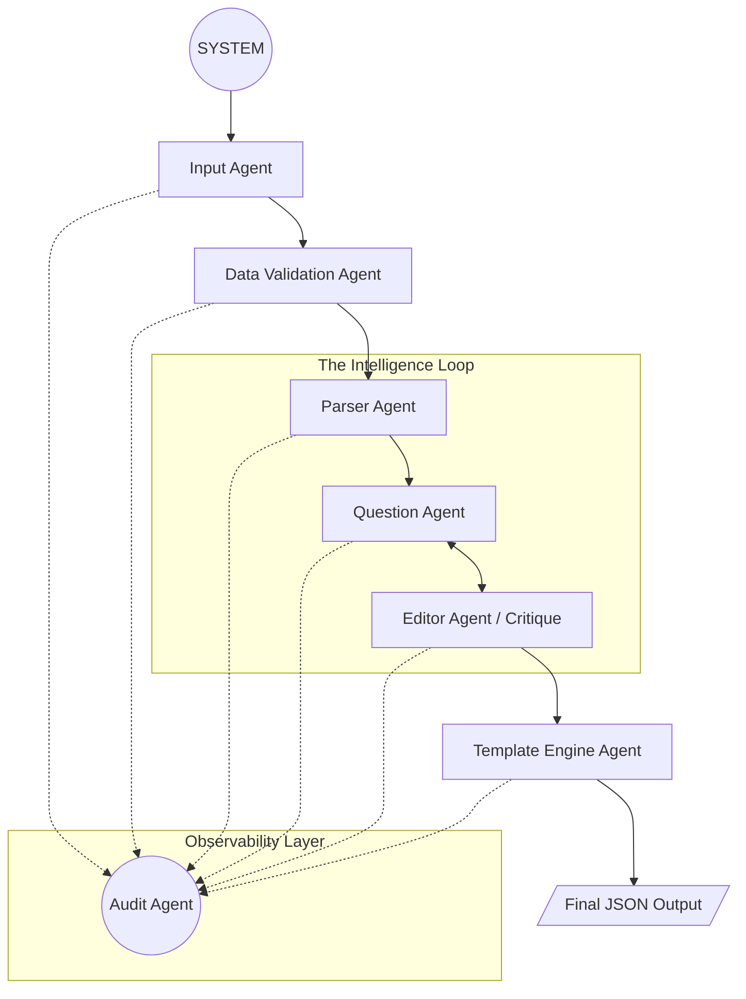
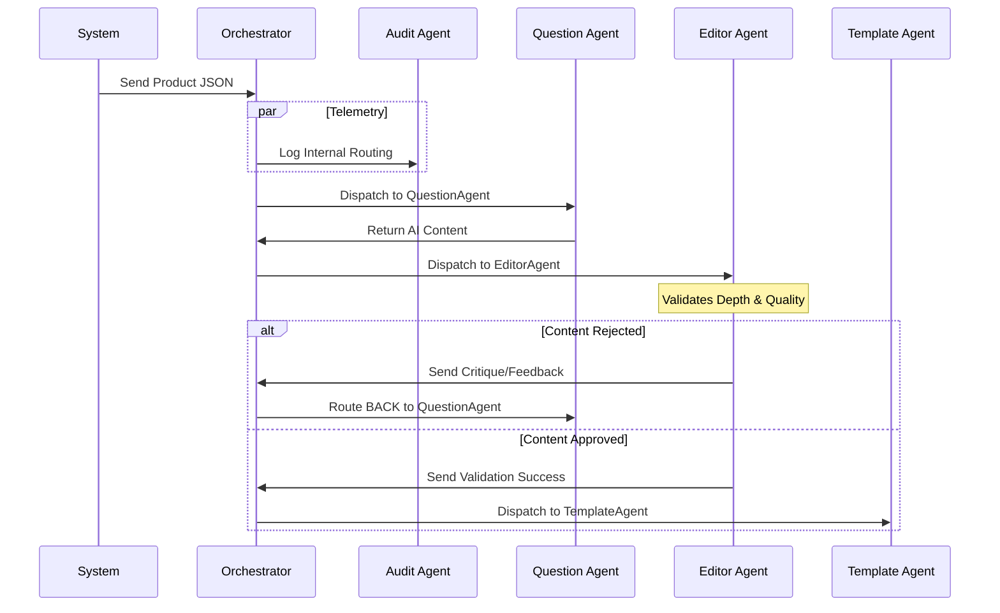
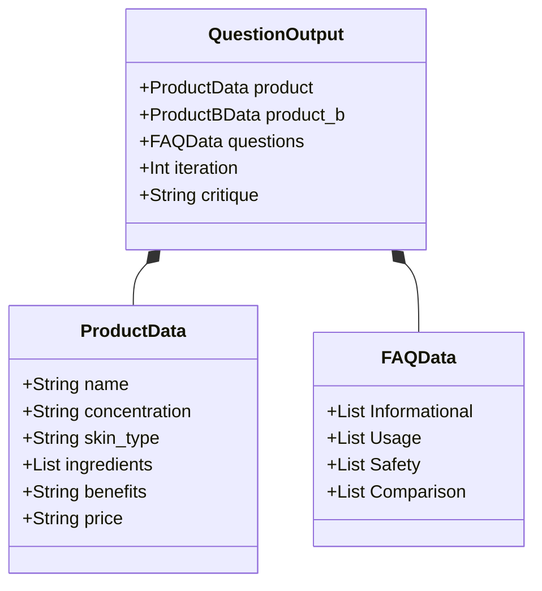

# Kasparro AI: Agentic Content Generation System

## Problem Statement
Standard e-commerce content generation often suffers from "Hallucination Pipelines"—linear scripts that push raw AI output directly to production without validation or contextual depth. These systems lack the autonomy to self-correct, fail to provide an audit trail for debugging agent interactions, and are brittle to changes in input data structures.

## Solution Overview
- **Multi-Agent Message-Bus**: Decoupled async orchestration.
- **Autonomous Feedback**: Editor-driven critique and retry loops.
- **Specialized Roles**: Modular agents for validation, parsing, and hydration.
- **Truth Persistence**: Strict Pydantic contracts and audit logging.

## Scopes & Assumptions
- **Scope**: Generates a Product Detail Page, an Intelligent FAQ, and a Competitor Comparison Page.
- **AI Engine**: Utilizes Google Gemini (Flash) models with a sophisticated mock fallback for local development or API downtime.
- **Concurrency**: Built on an `asyncio` event loop to handle concurrent agent tasks and I/O-bound AI requests.
- **Assumptions**: Input data is provided as JSON; valid API keys are stored in environment variables; output is strictly machine-readable JSON.

## System Design (Architecture)

### 1. Orchestration Model: Async Message-Bus
- **Centralized Router**: The Orchestrator manages all traffic.
- **Message Decoupling**: Agents communicate solely via `Message` objects.
- **Async Efficiency**: `asyncio.Queue` handles non-blocking execution.
- **Scalable Architecture**: Easy integration of new autonomous workers.

### 2. Physical Flow & Interaction Models

#### A. Process Topology (Flowchart)
Determines the **path of data** and the **autonomous loops** within the system.

#### B. Agent Coordination (Sequence Diagram)
Determines the **temporal interaction** and proves the **decoupling of agents** via the central Orchestrator.

### 3. Data Integrity & Contracts
- **Pydantic Contracts**: Enforced schemas for all agent interactions.
- **Early-Fail Pattern**: Validation occurs at every handoff point.
- **Type Safety**: Eliminates silent failures in AI content generation.

#### System Schema (Class Diagram)
Determines the **data contract structures** that agents must adhere to.

### 4. Custom Template Engine & Reusable Blocks
- **Logic-Block Mapping**: Categorized FAQs and comparisons as discrete modules.
- **Declarative Hydration**: Structured JSON templates define fields and rules.
- **Content Composability**: Reusable benefits and safety blocks across page types.
- **Structural Separation**: Layout is completely decoupled from content logic.

