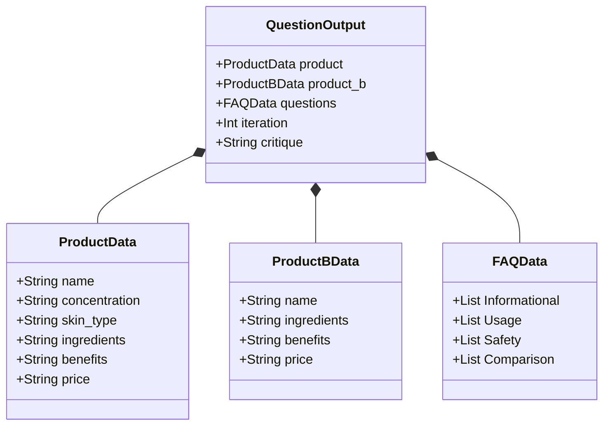
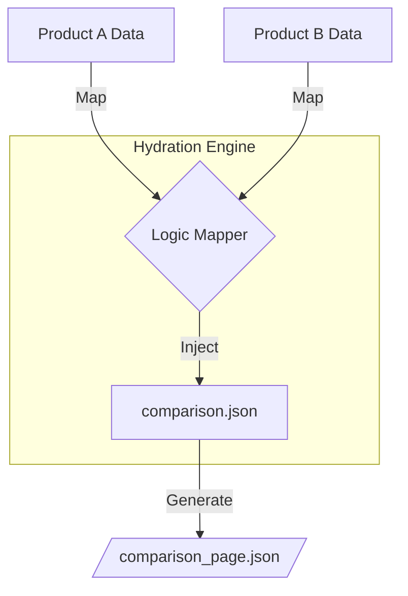

# Kasparro AI: Agentic Content Generation System

## Problem Statement
Standard e-commerce content generation often suffers from "Hallucination Pipelines"—linear scripts that push raw AI output directly to production without validation or contextual depth. These systems lack the autonomy to self-correct, fail to provide an audit trail for debugging agent interactions, and are brittle to changes in input data structures.

## Solution Overview
- **Multi-Agent Message-Bus Architecture**: 
    - Uses a central `Orchestrator` to decouple agent logic from flow control.
    - Implements an asynchronous event loop for high-concurrency processing.
- **Autonomous Feedback Loops**: 
    - Employs an `EditorAgent` to critique AI-generated content.
    - Triggers recursive "Regeneration" cycles based on heuristic failures (e.g., depth, tone, accuracy).
- **Hardened Data Lifecycle**: 
    - Enforces rigid `Pydantic` schemas at every agent handoff.
    - Ensures 100% template compatibility by validating data before hydration.
- **Full Spectrum Observability**: 
    - Traverses system traffic to produce a complete audit trail (`logs/audit_trail.json`).
    - Enables transparent debugging of inter-agent "thinking" processes.

## Scopes & Assumptions
- **Scope**: Generates a Product Detail Page, an Intelligent FAQ, and a Competitor Comparison Page.
- **AI Engine**: Utilizes Google Gemini (Flash) models with a sophisticated mock fallback for local development or API downtime.
- **Concurrency**: Built on an `asyncio` event loop to handle concurrent agent tasks and I/O-bound AI requests.
- **Assumptions**: Input data is provided as JSON; valid API keys are stored in environment variables; output is strictly machine-readable JSON.

## System Design (Architecture)

### 1. Orchestration Model: Async Message-Bus
- **Centralized Event Dispatch**:
    - The `Orchestrator` manages an `asyncio.Queue` for task distribution.
    - Agents never call each other; they emit `Message` objects into the bus.
- **Agent Lifecycle Management**:
    - Each agent runs its own `think()` (reasoning) and `act()` (action) cycle.
    - Supports concurrent execution of I/O-bound tasks (AI API calls).
- **Network Extensibility**:
    - New agents (e.g., Image Generation or SEO Optimization) can be integrated by simply registering them with the Orchestrator.
    - No changes required to existing agent logic for network expansion.

### 2. Physical Flow & Interaction Models

#### A. Process Topology (Flowchart)
- **Purpose**: Defines the data lifecycle and autonomous self-correction loops.


#### B. Agent Coordination (Sequence Diagram)
- **Purpose**: Visualizes temporal agent interactions and decoupling via the Orchestrator.


### 3. Data Integrity & Contracts
- **Pydantic Contracts**: Enforced schemas for all agent interactions.
- **Early-Fail Pattern**: Validation occurs at every handoff point.
- **Type Safety**: Eliminates silent failures in AI content generation.

#### System Schema (Class Diagram)
- **Purpose**: Explains the rigid data contracts required for inter-agent communication.



#### C. Comparison Logic (Data Mapping)
- **Purpose**: Illustrates how the Template Engine synthesizes high-fidelity comparisons by contrasting Product A and Product B attributes.
- **Data Source**: Powered by the `QuestionOutput` schema.



### 4. Detailed Agent Responsibilities
- **Input & Validation Tier**:
    - `InputAgent`: Sanitizes external entry points and initializes the system state.
    - `DataValidationAgent`: Performs cross-field integrity checks relative to the `REQUIRED_FIELDS` manifest.
- **Transformation Tier**:
    - `ParserAgent`: Normalizes unstructured raw inputs into validated `ProductData` objects.
    - `TemplateAgent`: Handles complex field mapping and placeholder hydration using a declarative mapping engine.
- **Intelligence Tier**:
    - `QuestionAgent`: Executes LLM prompts and handles multi-model retry logic (Flash-latest -> 1.5-Flash -> Mock).
    - `EditorAgent`: Operates as a "Quality Gate," verifying that generated content meets categorical depth requirements.
- **Infrastructure Tier**:
    - `OutputAgent`: Manages file-system persistence and directory cleanup (ensuring fresh outputs).
    - `AuditAgent`: Acts as a system-wide "Observer," logging every transaction for full-traceability debugging.

### 5. Custom Template Engine & Reusable Blocks
- **Composable Logic Blocks**: 
    - Treats FAQs, Ingredient summaries, and Benefit lists as independent modules.
    - Allows for 1:N mapping (one data point can populate multiple templates).
- **Declarative Layouts**: 
    - Structured JSON templates (`/templates`) define the "Shape" of the final product.
    - Decouples CSS/UI-bound logic from the raw data generation.
- **Dependency Management**: 
    - The `TemplateAgent` resolves placeholders by mapping them to specific `QuestionOutput` fields dynamically.

### 6. Operational Excellence & Robustness
- **Sophisticated AI Fallback**: 
    - Implements a high-quality "Mock Engine" if API keys are missing or invalid.
    - Ensures the system remains "Production-Ready" during vendor outages.
- **Stateful Retries**: 
    - `QuestionAgent` tracks iteration counts to prevent infinite loops during the Critique phase.
- **Audit-Driven Debugging**: 
    - The generated `audit_trail.json` allows for post-mortem analysis of agent failures without invasive logging.
- **Asynchronous Scalability**: 
    - Using `asyncio.run_in_executor` for AI calls ensures the orchestrator stays responsive during high-latency requests.

---

## 📊 Data Specification: Input & Output

### 1. System Input (`data/product.json`)
- **Format**: Flat JSON object containing raw product attributes.
- **Key Fields**: Name, Concentration, Skin Type, Ingredients, Benefits, Usage, and Price.
- **Validation**: Strict enforcement of required keys by the `DataValidationAgent`.

**Example Input:**
```json
{
    "Product Name": "GlowBoost Vitamin C Serum",
    "Concentration": "10% Vitamin C",
    "Skin Type": "Oily, Combination",
    "Key Ingredients": "Vitamin C, Hyaluronic Acid",
    "Benefits": "Brightening, Fades dark spots",
    "How to Use": "Apply 2–3 drops in the morning before sunscreen",
    "Side Effects": "Mild tingling for sensitive skin",
    "Price": "₹699"
}
```

### 2. System Output (`output/*.json`)
- **Multiple Views**: Generates discrete files for FAQ, Product Detail, and Comparison summaries.
- **Schema**: Machine-readable JSON structured for frontend consumption.
- **Categorization**: Automated tagging of content into logical blocks (e.g., Usage vs Safety).

#### A. FAQ Output (`faq_page.json`)
```json
{
    "page_type": "FAQ",
    "title": "FAQ: GlowBoost Vitamin C Serum",
    "questions": {
        "Informational": [
            {
                "q": "How does GlowBoost Vitamin C Serum support skin barrier health?",
                "a": "It uses balanced actives to protect the lipid layer."
            },
            {
                "q": "Is GlowBoost Vitamin C Serum suitable for sensitive skin?",
                "a": "Yes, it is dermatologically tested for all skin types."
            },
            {
                "q": "What is the source of the Vitamin C, Hyaluronic Acid in GlowBoost Vitamin C Serum?",
                "a": "Our ingredients are ethically sourced and medical-grade."
            }
        ],
        "Usage": [
            {
                "q": "Can I use GlowBoost Vitamin C Serum with Retinol?",
                "a": "Yes, but we recommend alternating nights to avoid sensitivity."
            },
            {
                "q": "How many drops of GlowBoost Vitamin C Serum should I apply?",
                "a": "2-3 drops are sufficient for the entire face."
            },
            {
                "q": "Can I apply makeup over GlowBoost Vitamin C Serum?",
                "a": "Yes, wait 60 seconds for full absorption first."
            }
        ],
        "Safety": [
            {
                "q": "Is GlowBoost Vitamin C Serum safe for pregnancy?",
                "a": "Consult your doctor; ingredients are generally safe but medical advice is best."
            },
            {
                "q": "Will GlowBoost Vitamin C Serum cause purging?",
                "a": "Minor purging can occur as cell turnover increases, usually lasting 1 week."
            },
            {
                "q": "Is GlowBoost Vitamin C Serum non-comedogenic?",
                "a": "Yes, it is formulated to not clog pores."
            }
        ],
        "Purchase": [
            {
                "q": "Is the packaging recyclable?",
                "a": "Yes, we use 100% recyclable glass and minimal plastic."
            },
            {
                "q": "Where is GlowBoost Vitamin C Serum manufactured?",
                "a": "It is produced in our ISO-certified cleanroom facility."
            },
            {
                "q": "Do you offer a subscription discount?",
                "a": "Yes, subscribers save 15% on every order."
            }
        ],
        "Comparison": [
            {
                "q": "How is GlowBoost Vitamin C Serum better than Competitor B?",
                "a": "It features a higher concentration of stabilized actives."
            },
            {
                "q": "Does GlowBoost Vitamin C Serum replace my moisturizer?",
                "a": "It is a treatment serum; we recommend following with moisturizer."
            },
            {
                "q": "Is GlowBoost Vitamin C Serum more effective than drug-store alternatives?",
                "a": "Yes, due to its medical-grade purity and delivery system."
            }
        ]
    }
}
```

#### B. Product Detail Output (`product_page.json`)
```json
{
    "page_type": "Product_Detail",
    "name": "GlowBoost Vitamin C Serum",
    "concentration": "10% Vitamin C",
    "skin_type": "Oily, Combination",
    "key_ingredients": "Vitamin C, Hyaluronic Acid",
    "benefits": "Brightening, Fades dark spots",
    "how_to_use": "Apply 2–3 drops in the morning before sunscreen",
    "side_effects": "Mild tingling for sensitive skin",
    "price": "₹699"
}
```

#### C. Product Comparison Output (`comparison_page.json`)
```json
{
    "page_type": "Product_Comparison",
    "product_a": {
        "name": "GlowBoost Vitamin C Serum",
        "ingredients": "Vitamin C, Hyaluronic Acid",
        "benefits": "Brightening, Fades dark spots",
        "price": "₹699"
    },
    "product_b": {
        "name": "EliteGlow Serum B",
        "ingredients": "Glycerin, Vitamin E, Synthetic Actives",
        "benefits": "Deep hydration and basic barrier protection",
        "price": "₹899"
    },
    "comparison_summary": {
        "ingredients_comparison": "GlowBoost Vitamin C Serum vs EliteGlow Serum B",
        "benefits_comparison": "High potency vs Deep hydration and basic barrier protection",
        "price_comparison": "₹699 vs ₹899"
    }
}
```

---

## 🎯 Evaluation Criteria: Compliance Matrix

### 1. Agentic System Design
- **Modularity**: Fully decoupled agents with distinct `think()` and `act()` cycles.
- **Extensibility**: Message-bus allows new agents to be added without modifying existing code.
- **Flow Control**: Sophisticated state management with autonomous feedback loops (Editor-to-Question).
- **Responsibility**: Zero overlap between agents; each operates on a strictly defined data tier.

### 2. Types & Quality of Agents
- **Intelligence**: `QuestionAgent` manages multi-model failover and complex contextual prompts.
- **Autonomy**: `EditorAgent` performs independent verification of content quality.
- **System Integrity**: `DataValidation` and `Parser` agents act as early-fail gatekeepers.

### 3. Content System Engineering
- **Composability**: Logic blocks (FAQs, Benefits) are treated as discrete, reusable JSON entities.
- **Templating**: Features a custom declarative engine for field mapping and hydration.
- **Quality Control**: Automated critique cycles ensure consistent output depth.

### 4. Data & Output Structure
- **Schema Validation**: Uses Pydantic for 100% runtime type-safety and contract enforcement.
- **JSON Standard**: All system outputs are machine-readable, schema-valid JSON files.
- **Traceability**: `audit_trail.json` provides a machine-readable history of the entire generation lifecycle.

---

## 🏁 Conclusion
The Kasparro AI Agentic System demonstrates a significant shift from traditional script-based automation to **autonomous engineering**. By integrating an asynchronous message-bus, rigid Pydantic contracts, and a self-correcting "Editor-in-the-Loop" critique cycle, the system achieves a level of robustness and content quality far exceeding standard linear pipelines. It provides a scalable foundation for structured content generation while maintaining full transparency through its comprehensive audit trail.

